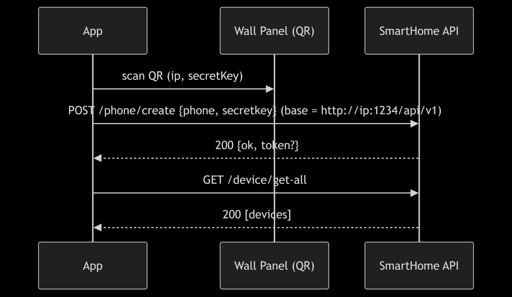
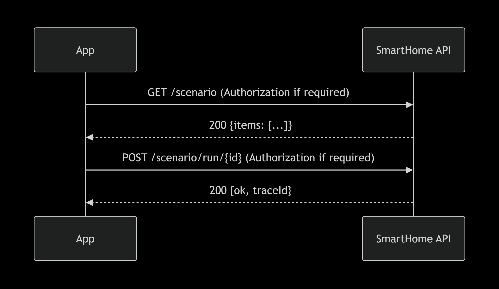
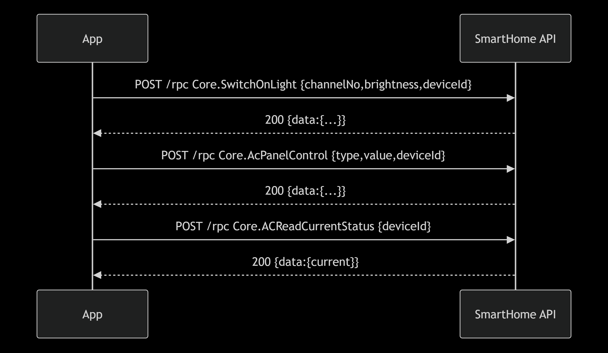

<div dir="rtl">

# API Gateway or Routing Design — Smart Home

## هدف
 ارتباط اپ با کنترل ‌پنل. QRCode از روی پنل **IP** و **secretKey** می‌دهد؛ اپ بر اساس آن **Base URL** را می‌ سازد و ثبت تلفن، سناریو و… را انجام می‌دهد.

---

## Base URL (از روی QR)
- QR → `ip` و `secretKey`
- **Base URL:**  
http://ip:1234/api/v1
مثال: `http://10.38.9.65:1234/api/v1`

---

## مسیرها و متدها

### Device
| Method | Path             | توضیح | نوت |
|-------|------------------|------|-----|
| GET   | `/device/get-all`| گرفتن لیست دستگاه‌ ها | **Base URL محلی با IP** |

### RPC (فرمان‌های دستگاه)
همه با `POST /rpc` و بدنه‌ی JSON.
| Method | Path  | method_name                 | params نمونه |
|-------|-------|-----------------------------|--------------|
| POST  | `/rpc`| `Core.Scenario`             | `{"data":{"additionalProp1":{}},"device":{"deviceId":123,"deviceName":"test"}}` |
| POST  | `/rpc`| `Core.AcPanelControl`       | `{"data":{"type":"cool","value":"23"},"device":{"deviceId":123}}` |
| POST  | `/rpc`| `Core.ACReadCurrentStatus`  | `{"data":{"additionalProp1":{}},"device":{"deviceId":123,"deviceName":"string"}}` |
| POST  | `/rpc`| `Core.SwitchOnLight`        | `{"data":{"channelNo":1,"brightness":100,"runningTime":0},"device":{"deviceId":123,"deviceName":"test"}}` |

> پاسخ‌ها معمولاً شامل فیلد `data` هستند (در کد از `response["data"]` استفاده می‌کنی).

### Section
| Method | Path                       | توضیح |
|-------|----------------------------|------|
| POST  | `/section/create`          | ساخت سکشن: `{name,color}` |
| DELETE| `/section/delete/{id}`     | حذف سکشن |
| GET   | `/section/get-all`         | گرفتن همه سکشن‌ها (**Base URL محلی**) |
| GET   | `/section/get/{id}`        | گرفتن یک سکشن |
| PUT   | `/section/update/{id}`     | بروزرسانی سکشن: `{name,color}` |

### Sub-section 
| Method | Path                                                | توضیح |
|-------|-----------------------------------------------------|------|
| POST  | `/sub-section/create`                               | ساخت زیر‌بخش: بدنه از `SubSectionModel.toJson()` |
| DELETE| `/sub-section/delete/{id}`                          | حذف |
| GET   | `/sub-section/get-by-section-id-and-type/{sid}/{t}`| فهرست زیر‌بخش‌های سکشن با نوع (**Base URL محلی**) |
| GET   | `/sub-section/get/{subSectionID}`                   | دریافت زیر‌بخش |
| PUT   | `/sub-section/update/{subSectionID}`                | بروزرسانی: بدنه از `SubSectionModel.toJson()` |

### Scenario
| Method | Path                       | توضیح |
|-------|----------------------------|------|
| POST  | `/scenario/run/{scenarioId}` | اجرای سناریو | 
| GET   | `/scenario`                | لیست سناریوها | 


### Phone (ثبت کلاینت موبایل/TV)
| Method | Path           | بدنه نمونه |
|-------|----------------|-----------|
| POST  | `/phone/create`| ```json
{
"phone": {"ip": "192.168.1.10", "mac":"string","ostype":"string","osversion":"string"},
"secretkey": "<from-QR>"
}

## 1) دیاگرام اسکن QR code




## 2) اجرای سناریو



## 3) فرمان‌های RPC (از روی مثال ها)



</div>