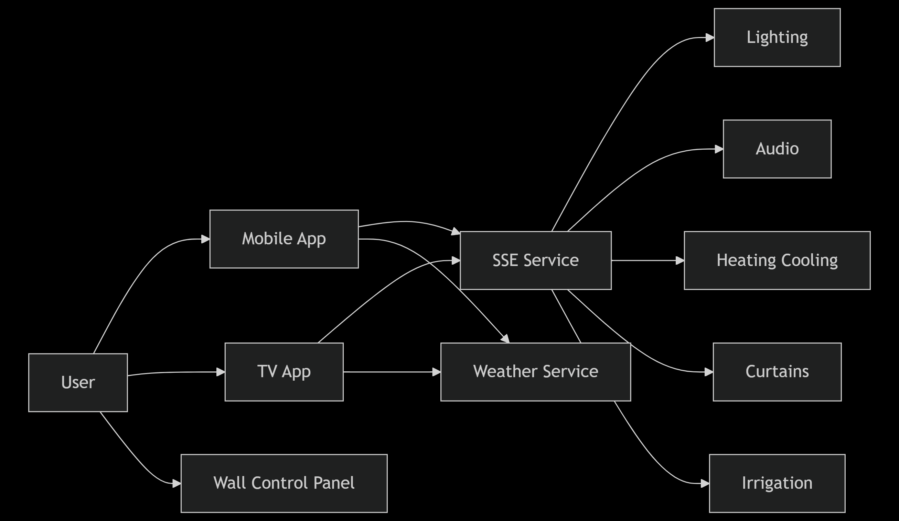

# C1 — System Context (Smart Home)

## هدف
نمای کلی سیستم اسمارت‌ هوم: اپ موبایل و TV برای کنترل روشنایی، صوتی، گرمایش/سرمایش، پرده و آبیاری؛ با ارتباط بلادرنگ از طریق سرویس SSE و هسته‌ی مشترک رابط کاربری. (State Management: GetX، Shared UI: Arsit Core) 

---

## نقش‌ها و سامانه‌ها
- **User / Resident**: استفاده از اپ‌ ها و کنترل بخش‌ ها. 
- **Mobile App (Flutter)**: اپ اصلی برای کنترل؛ از GetX و Core Package مشترک استفاده می‌کند. 
- **TV App (Flutter)**: نسخه‌ی مخصوص تلویزیون، با Core مشترک. 
- **SSE Service**: ارتباط بلادرنگ و واکنشی.  
- **External Services**: داده‌ی وضعیت هوا و موقعیت برای داشبورد. 

---

## نمودار کانتکست (C1)

