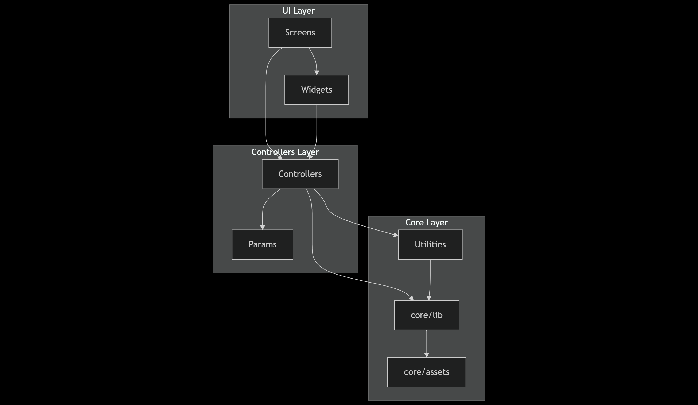

# C2 — Services Dependency Diagram (Smart Home)

## هدف
نمای وابستگی لایه ها و فولدرهای پروژه. مسیر جریان وابستگی از UI تا کنترلر و لایه های هسته ای مشخص است.

---

## ساختار فولدر و نقش هر کدام
- `lib/controllers/`  
  using GET X state manager
- `lib/core/`  
  کدهای مشترک و هسته ای:
  - `core/assets/`  
  - `core/lib/`
- `lib/params/` 
- `lib/screens/` 
- `lib/utilities/`  
- `lib/widgets/`  

---

## دیاگرام لایه ها بر مبنای فولدر

