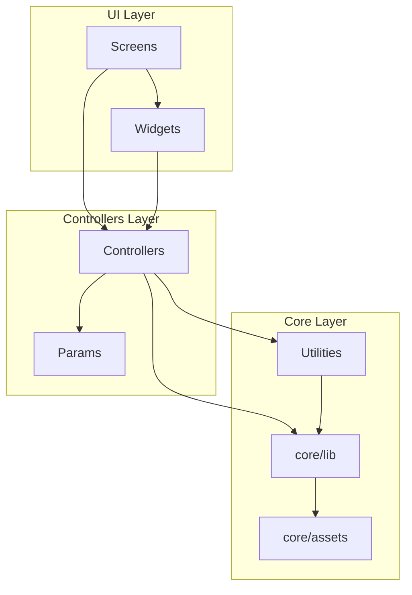

# C2 — Services Dependency Diagram (Smart Home)

## هدف
نمای وابستگی لایه ها و فولدرهای پروژه. مسیر جریان وابستگی از UI تا کنترلر و لایه های هسته ای مشخص است.

---

## ساختار فولدر و نقش هر کدام
- `lib/controllers/`  
  کنترل کننده ها  GetX یا معادل آن  منطق صفحه و فراخوانی یوزکیس و ریپو را هدایت می کند.
- `lib/core/`  
  کدهای مشترک و هسته ای. زیرشاخه ها:
  - `core/assets/`  مسیرها و ثوابت مربوط به فایل های گرافیکی و متنی
  - `core/lib/`     مدل ها  یوزکیس ها  ریپازیتوری ها  ابزار مشترک
- `lib/params/`  
  آبجکت های پارامتر برای ناوبری و فراخوانی ها  Data Transfer Objects
- `lib/screens/`  
  صفحات UI
- `lib/utilities/`  
  ابزارهای عمومی  زمان  فرمت  لاگ  نتورک رپر
- `lib/widgets/`  
  ویجت های قابل استفاده مجدد

---

## دیاگرام لایه ها بر مبنای فولدر

